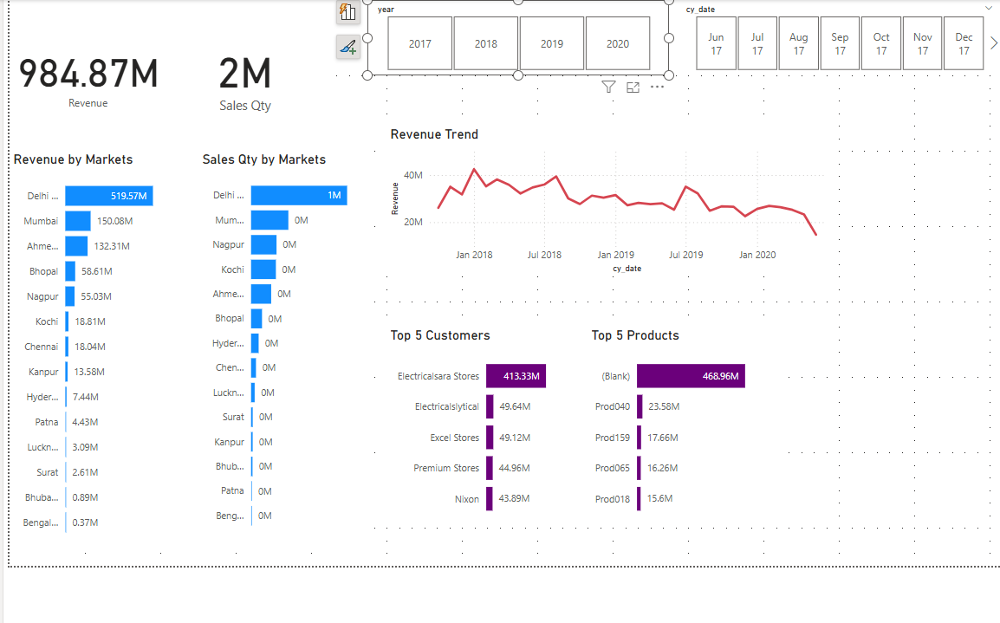
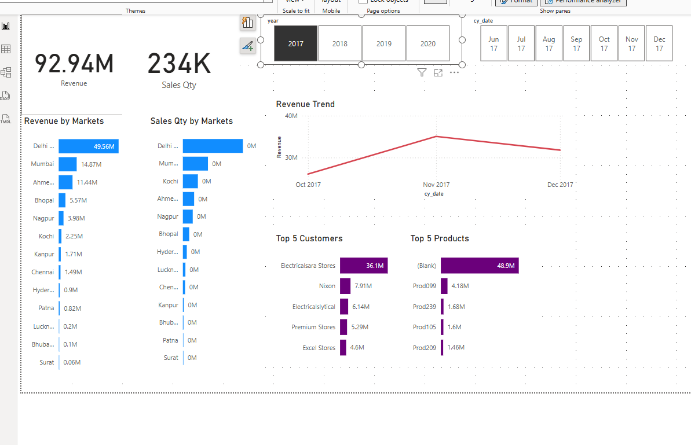

📊 Sales Insights Dashboard

An interactive dashboard built using Power BI to analyze sales performance across regions, customers, and products.

📈 Project Overview

This project aims to provide a clear visual understanding of the sales data using Power BI. The dashboard answers key business questions like:

Which region brings in the most revenue?

What is the monthly revenue trend?

Who are the top-performing customers and products?

⚙️ Tools Used

Power BI for data modeling and interactive visuals

SQL Server for importing structured sales data

🔢 Dataset Includes

Revenue by Market

Sales Quantity by Market

Top 5 Customers

Top 5 Products

Monthly Revenue Trend

Time Slicers by Year and Date

👀 Visual Highlights

Revenue by Market

Sales Quantity by Market

Revenue Trend Over Time

Top Customers and Products

## 📊 Dashboard Preview

### Sales Dashboard Overview

### 2017

🔍 Key Insights

Delhi leads the market with the highest revenue.

A few major customers contribute significantly to overall sales.

Sales performance fluctuates month to month, with clear trends visible in the timeline.

📒 File

FirstSales_insights.pbix: Full Power BI dashboard file.

🚀 How to Use

Download the .pbix file.

Open in Power BI Desktop.

Interact with filters and visuals for deeper insights.
